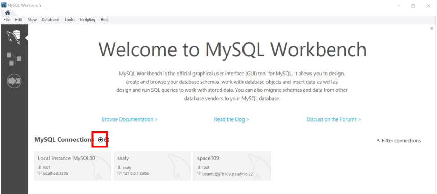
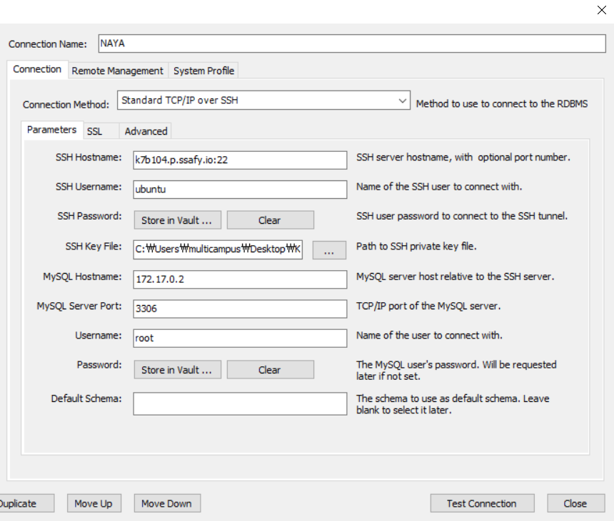
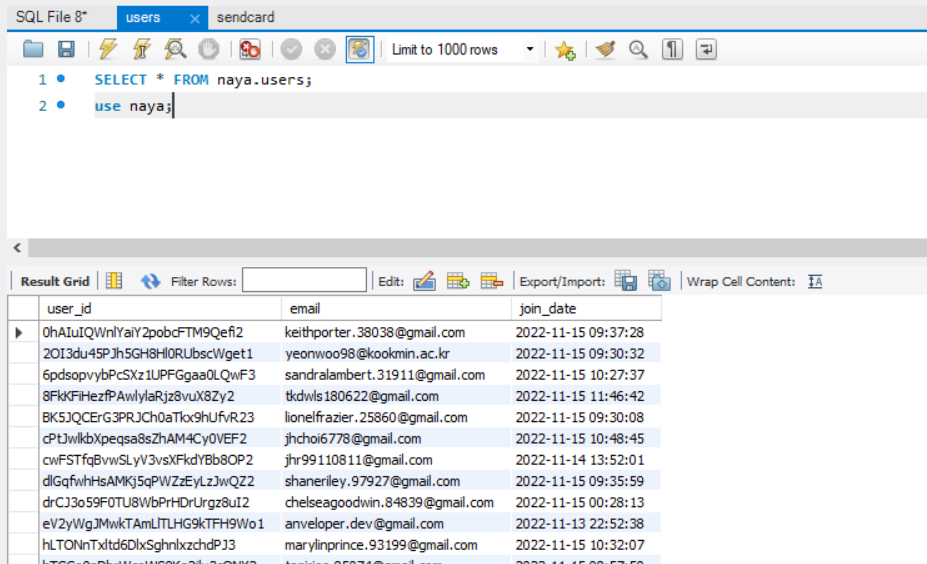

## 삼성 청년 SW 아카데미 대전캠퍼스 7기

## 자율 프로젝트 (2022. 10. 11 ~ 2022. 11. 18)

# 포팅 매뉴얼

### B104  |  김정윤 김성찬 안성진 연창모 주혜령 진윤아

# 1. 프로젝트 기술 스택

1. 이슈 관리 : Jira
2. 형상 관리 : GitLab
3. 커뮤니케이션 : Mattermost, Notion, Discord
4. 개발 환경
    - OS : Window 10
    - IDE
        - IntelliJ 2022.2
        - Android Studio
        - VisualStudio Code
    - Database : MySQL Workbench 8.0 CE
    - Server : AWS EC2 (MobaXterm)
        - Ubuntu 20.04.4 LTS
        - Docker 20.10.21
        - Jenkins 2.361.3
        - Nginx:stable-alpine(1.2.2)
5. 상세 내용
    - Backend
        - Java (Open JDK (Zulu 8.33.0.1))
        - Spring Boot Gradle 7.4
        - Lombok , JPA
    - Frontend
        - React
    - Android
        - 사용한 기술 버전 작성

# 2. 빌드 시 사용되는 환경 변수 등 주요 내용

- backend/NAYA/src/main/resources/application.properties 추가

```bash
server.servlet.context-path= /naya
server.port=8080

spring.datasource.driver-class-name=com.mysql.cj.jdbc.Driver
spring.datasource.url=jdbc:mysql://172.17.0.2:3306/naya?serverTimezone=UTC&characterEncoding=UTF-8
spring.datasource.username=root
spring.datasource.password=eowjswkdbfb104

#spring
#spring.jpa.show-sql=true.jpa.database-platform=org.hibernate.dialect.MySql8Dialect
spring.jpa.hibernate.ddl-auto=update

#spring.mvc.pathmatch.matching-strategy=ant_path_matcher
```

- frontend/.env 파일 추가 ??

```bash

```

- 관리자 계정 활성화

```bash
su passwd root
```

- 서버에 docker, docker-compose 설치

```bash
sudo apt install docker-ce docker-ce-cli containerd.io docker-compose
```

- 젠킨스 컨테이너 실행을 위한 docker-compose 작성 (~/docker-compose.yml)

```bash
version: '3'

services:
    jenkins:
        image: jenkins/jenkins:lts
        container_name: jenkins
        volumes:
            - /var/run/docker.sock:/var/run/docker.sock
            - /jenkins:/var/jenkins_home
        ports:
            - "9090:8080"
        privileged: true
        user: root
```

- 젠킨스에서 설치해야하는 플러그인 목록

```jsx
- 최초 Jenkins 로그인 후 [Install suggested plugins] 선택 후 다운로드
- Jenkins 로그인-> Jenkins 관리 -> 플러그인 관리 -> 설치 가능 탭

설치해야하는 플러그인 목록
- GitLab 
- Generic Webhook Trigger
- Gitlab API
- GitLab Authentication
- Docker
- Docker Commons
- Docker Pipeline
- Docker API
- Publish Over SSH
```

- 젠킨스 컨테이너 내부 접속 후 5번 따라 docker 설치

```bash
sudo docker exec -it {젠킨스 컨테이너 ID} /bin/bash
sudo apt install docker-ce docker-ce-cli containerd.io docker-compose
```

- 프론트 컨테이너 내부에서 사용할 letsencrypt파일 설정

```jsx
- standalone, agree, no, <domain_name> 으로 작성하면 인증서가 발급된다.
- domain_name은 사용하려는 실제 도메인이어야 한다.

Saving debug log to /var/log/letsencrypt/letsencrypt.log

How would you like to authenticate with the ACME CA?

- - - - - - - - - - - - - - - - - - - - - - - - - - - - - - - - - - - - - - - -

1: Spin up a temporary webserver (standalone)

2: Place files in webroot directory (webroot)

- - - - - - - - - - - - - - - - - - - - - - - - - - - - - - - - - - - - - - - -

Select the appropriate number [1-2] then [enter] (press 'c' to cancel): 1

Enter email address (used for urgent renewal and security notices)

(Enter 'c' to cancel): <<email>> 

- - - - - - - - - - - - - - - - - - - - - - - - - - - - - - - - - - - - - - - -

Please read the Terms of Service at

. You must

agree in order to register with the ACME server. Do you agree?

- - - - - - - - - - - - - - - - - - - - - - - - - - - - - - - - - - - - - - - -

(Y)es/(N)o: y 

- - - - - - - - - - - - - - - - - - - - - - - - - - - - - - - - - - - - - - - -

Would you be willing, once your first certificate is successfully issued, to

share your email address with the Electronic Frontier Foundation, a founding

partner of the Let's Encrypt project and the non-profit organization that

develops Certbot? We'd like to send you email about our work encrypting the web,

EFF news, campaigns, and ways to support digital freedom.

- - - - - - - - - - - - - - - - - - - - - - - - - - - - - - - - - - - - - - - -

(Y)es/(N)o: n // 광고 수신 여부

Account registered.

Please enter the domain name(s) you would like on your certificate (comma and/or

space separated) (Enter 'c' to cancel): <<domain_name>>

Requesting a certificate for <<domain_name>>

Successfully received certificate.

Certificate is saved at: /etc/letsencrypt/live/<<domain_name>>/fullchain.pem

Key is saved at:         /etc/letsencrypt/live/<<domain_name>>/privkey.pem

This certificate expires on 2021-12-25.

These files will be updated when the certificate renews.

NEXT STEPS:

- The certificate will need to be renewed before it expires. Certbot can automatically renew the certificate in the background, but you may need to take steps to enable that functionality. See  for instructions.

- - - - - - - - - - - - - - - - - - - - - - - - - - - - - - - - - - - - - - - -

If you like Certbot, please consider supporting our work by:

* Donating to ISRG / Let's Encrypt:

* Donating to EFF:

- - - - - - - - - - - - - - - - - - - - - - - - - - - - - - - - - - - - - - - -
```

# 3. 배포 과정

- 사전에 작성한 docker-compose파일 실행해 젠킨스 띄우기

```bash
sudo docker-compose up -d
```

- http://{서버주소}:9090/로 접속해 젠킨스 설치 및 환경 세팅
    - 젠킨스 비밀번호는 docker logs jenkins로 확인
    - 젠킨스 필수 플러그인 들 설치 후 freestyle 프로젝트 생성 (NAYA)
    - 해당 프로젝트에 깃랩 연결 후 빌드
    - 서버 /jenkins/workspace/NAYA 생성 확인
    
- DB로 사용할 MySQL 컨테이너 생성 및 세팅
    - MySQL 컨테이너 생성
    
    ```bash
    docker run --name naya_DB -e MYSQL_ROOT_PASSWORD -d mysql
    ```
    
    - Dump 넣기
    
    ```bash
    docker cp {덤프파일 위치} naya_DB:/home
    ```
    
    - naya_DB 내부 접속
    
    ```bash
    docker exec -it naya_DB bash
    ```
    
    - Dump import
    
    ```bash
    mysql -hlocalhost -uroot -p{password} < /home/{덤프파일명}
    ```
    
- /jenkins/workspace/NAYA에 docker 파일 작성
    - /jenkins/workspace/NAYA/backend/NAYA/Dockerfile
    
    ```bash
    FROM openjdk:8
    WORKDIR /var/jenkins_home/workspace/NAYA/backend/naya
    ENV TZ Asia/Seoul
    #VOLUME /tmp
    #ARG JAR_FILE=build/libs/*.jar
    #COPY {JAR_FILE} app.jar
    #RUN ln -snf /usr/share/zoneinfo/Asia/Seoul /etc/localtime
    COPY build/libs/NAYA-0.0.1-SNAPSHOT.jar app.jar
    ENTRYPOINT ["java","-jar","app.jar"]
    ```
    
    - /jenkins/workspace/NAYA/frontend/Dockerfile
    
    ```bash
    FROM node:16 as build-stage
    
    # 앱 디렉터리 생성
    WORKDIR /jenkins/workspace/NAYA/frontend
    ENV TZ Asia/Seoul
    
    # 앱 의존성 설치
    # 가능한 경우(npm@5+) package.json과 package-lock.json을 모두 복사하기 위해
    # 와일드카드를 사용
    COPY package*.json ./
    
    RUN npm install --save --legacy-peer-deps
    # 프로덕션을 위한 코드를 빌드하는 경우
    # RUN npm ci --only=production
    
    # 앱 소스 추가
    COPY . .
    
    RUN npm run build
    
    FROM nginx:stable-alpine as production-stage
    COPY --from=build-stage /jenkins/workspace/NAYA/frontend/build /usr/share/nginx/html
    COPY --from=build-stage /jenkins/workspace/NAYA/frontend/deploy_conf/nginx.conf /etc/nginx/conf.d/default.conf
    
    EXPOSE 3000
    CMD ["nginx", "-g", "daemon off;"]
    ```
    
    - /jenkins/workspace/NAYA/frontend/deploy_conf/nginx.conf
    
    ```bash
    upstream backend{
            ip_hash;
            server {내부 로컬 주소:포트번호}; ex)172.26.14.37:8080;
    }
    
    map $http_upgrade $connection_upgrade {
       default upgrade;
       ''      close;
    }
    
    server {
            listen  80;
            server_name     {도메인 주소}; ex) k7b104.p.ssafy.io;
            location / {
                    return 301 https://$host$request_uri;
            }
            #location /naya/api {
            #       proxy_name http://localhost:8080/naya/api;
            #}
    }
    
    server {
        listen       443 ssl;
    #    listen  [::]:443;
        server_name  {도메인 주소}; ex) k7b104.p.ssafy.io;
    
        access_log  /var/log/nginx/host.access.log  main;
    
       ssl_certificate /etc/letsencrypt/live/{도메인 주소}/fullchain.pem;
    # ex)   ssl_certificate /etc/letsencrypt/live/k7b104.p.ssafy.io/fullchain.pem;
    	 ssl_certificate_key /etc/letsencrypt/live/{도메인 주소}/privkey.pem;
    # ex)   ssl_certificate_key /etc/letsencrypt/live/k7b104.p.ssafy.io/privkey.pem;
       ssl_protocols TLSv1 TLSv1.1 TLSv1.2 TLSv1.3 SSLv3;
       ssl_ciphers ALL;
    
        location / {
            root   /usr/share/nginx/html;
            index  index.html index.htm;
            error_page 405 = $uri;
            proxy_redirect off;
            try_files $uri.html $uri $uri/ /index.html;
    
    				charset utf-8;
            proxy_http_version 1.1;
            proxy_set_header Upgrade $http_upgrade;
            proxy_set_header Connection "upgrade";
            proxy_set_header Host $host;
            proxy_set_header X-Real-IP $remote_addr;
            proxy_set_header X-Forwarded-For $proxy_add_x_forwarded_for;
            proxy_set_header X-Forwarded-Proto $scheme;
            proxy_set_header X-Nginx-Proxy true;
        }
    
            location /api/ {
            proxy_pass http://backend/;
            proxy_redirect     off;
            charset utf-8;
            proxy_http_version 1.1;
            proxy_set_header Upgrade $http_upgrade;
            proxy_set_header Connection "upgrade";
            proxy_set_header Host $host;
            proxy_set_header X-Real-IP $remote_addr;
            proxy_set_header X-Forwarded-For $proxy_add_x_forwarded_for;
            proxy_set_header X-Forwarded-Proto $scheme;
            proxy_set_header X-Nginx-Proxy true;
        }
    
        #error_page  404              /404.html;
    
        # redirect server error pages to the static page /50x.html
        #
        error_page   500 502 503 504  /50x.html;
        location = /50x.html {
            root   /usr/share/nginx/html;
        }
    	
    		# proxy the PHP scripts to Apache listening on 127.0.0.1:80
        #
        #location ~ \.php$ {
        #    proxy_pass   http://127.0.0.1;
        #}
    
        # pass the PHP scripts to FastCGI server listening on 127.0.0.1:9000
        #
        #location ~ \.php$ {
        #    root           html;
        #    fastcgi_pass   127.0.0.1:9000;
        #    fastcgi_index  index.php;
        #    fastcgi_param  SCRIPT_FILENAME  /scripts$fastcgi_script_name;
        #    include        fastcgi_params;
        #}
    
        # deny access to .htaccess files, if Apache's document root
        # concurs with nginx's one
        #
        #location ~ /\.ht {
        #    deny  all;
        #}
    }
    ```
    
- 젠킨스에 접속해 빌드 설정 마무리
    - Build Steps - Excute shell 추가
    
    ```bash
    docker image prune -a --force
    mkdir -p /var/jenkins_home/images
    cd /var/jenkins_home/workspace/NAYA/frontend/
    docker build -t react .
    docker save react > /var/jenkins_home/images/react.tar
    
    cd /var/jenkins_home/workspace/NAYA/backend/NAYA/
    chmod +x ./gradlew
    ./gradlew clean build
    docker build -t springboot .
    docker save springboot > /var/jenkins_home/images/springboot.tar
    
    ls /var/jenkins_home/images
    ```
    
    - 빌드 후 조치 추가
    
    ```bash
    sudo docker load < /jenkins/images/react.tar
    sudo docker load < /jenkins/images/springboot.tar
    
    if (sudo docker ps -a | grep "react"); then sudo docker stop react; fi
    if (sudo docker ps -a | grep "springboot"); then sudo docker stop springboot; fi
    
    sudo docker run -it -d --rm -p 80:80 -p 443:443 -v /home/ubuntu/certbot/conf:/etc/letsencrypt/ -v /home/ubuntu/certbot/www:/var/www/certbot --name react react
    echo "Run frontend"
    sudo docker run -it -d --rm -p 8080:8080 --name springboot springboot
    echo "Run backend"
    ```
    
    - 재빌드 후 https://{서버주소}로 접속 확인
    

# 4. 배포 특이사항

- DB
    - 해당 포팅 매뉴얼은 DB 컨테이너가 react컨테이너와 spring컨테이너보다 먼저 실행되어 계속 돌고있다는 가정하에 작성되었으므로 반드시 먼저 실행해야 함
    

# 5. DB 접속 정보 및 프로퍼티

- 새로운 커넥션 생성
    
    
    

- 아래와 같이 설정
    
    
    

- 접속 확인
    
    
